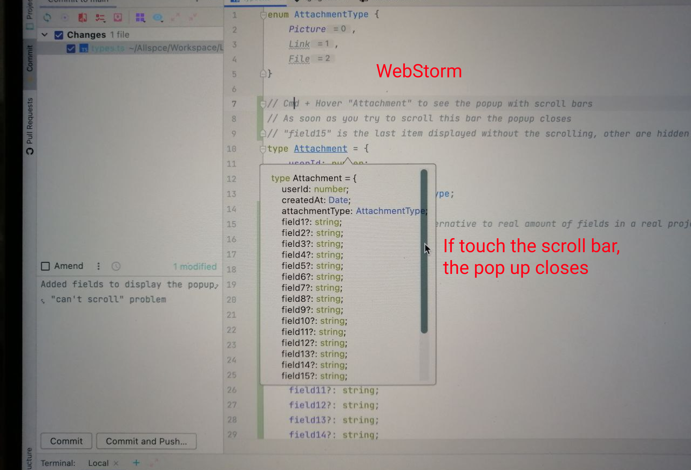

### WebStorm displays the variable type documentation ugly (hover the `User` type to reproduce)

**UPDATE** (27 of March, 2022)

`Hover + Cmd` in Webstorm shows the types identical to formatted JSON in VS Code.

This could solve the problem if only the popup would not become unscrollable.
See the pic below:

Also see comments on lines 7 - 9 in [types.ts](./types.ts) to get more context.  

---

**Expected view**: type is beautifully formatted as JSON

**Got view**: type is displayed in one unreadable line

#### How it looks in WebStorm

 

#### How the same looks in VS Code (it should to be the same in WebStorm)

